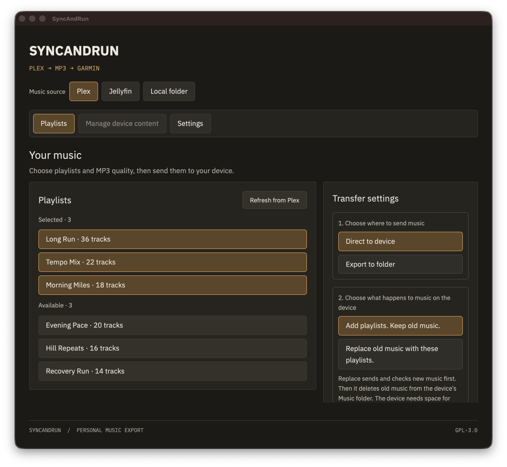
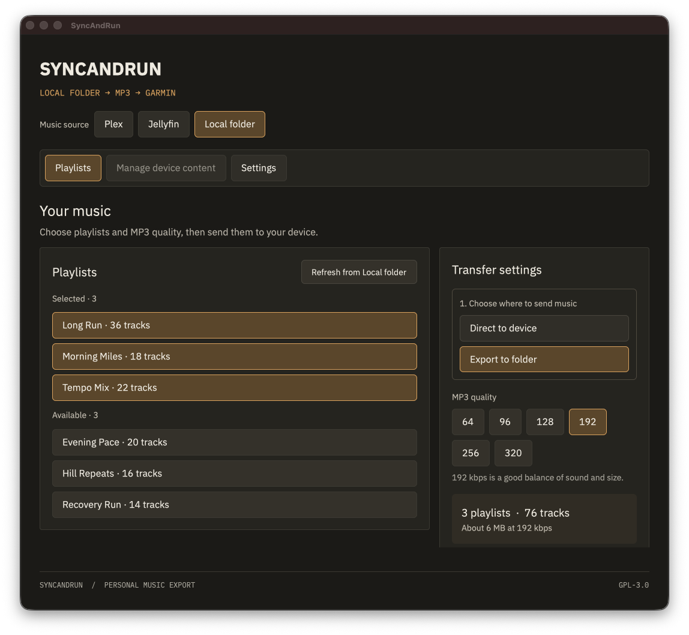

# SyncAndRun

SyncAndRun moves music from Plex, Jellyfin, or a local folder to a Garmin music watch. It runs as a native desktop app on macOS and Linux. Choose playlists, choose MP3 quality, and send the music over USB. You can also export playlist folders for a manual copy.





These screenshots use an isolated demo profile, a fake Plex server, and generated audio. The playlist names and track counts are synthetic.

## Download and install

Download the current packages from [GitHub Releases](https://github.com/ryancummings/syncandrun/releases). Choose the file for your computer.

| Computer | File | Install |
| --- | --- | --- |
| Apple Silicon Mac | `SyncAndRun-0.2.0-macos-arm64.dmg` | Open the DMG. Drag SyncAndRun to Applications. |
| Ubuntu 24.04 x86_64 | `SyncAndRun-0.2.0-linux-x86_64.tar.gz` | Install the system packages below. Extract the archive and run `./install.sh`. |

The Mac package includes the audio and USB libraries that it needs. It has a local signature, but Apple has not notarized it. If macOS blocks the first launch, open System Settings, select Privacy & Security, and select Open Anyway. [Apple explains this step](https://support.apple.com/en-gb/102445). The Mac package targets Apple Silicon and macOS 13 or later.

On Ubuntu 24.04, install the runtime packages before you run the app:

```sh
sudo apt-get update
sudo apt-get install libmtp9 libssl3t64 libfontconfig1 libxkbcommon0 \
  libxkbcommon-x11-0 libwayland-client0 libxcb1 libxcb-shape0 \
  libxcb-xfixes0 libx11-xcb1 libvulkan1 mesa-vulkan-drivers \
  xdg-desktop-portal xdg-desktop-portal-gtk ffmpeg
```

Extract the Linux archive, open its `SyncAndRun-0.2.0-linux-x86_64` folder, and run `./install.sh`. The installer copies the app, CLI, icon, and desktop entry into `~/.local`. Open SyncAndRun from your app launcher. The Linux app needs a graphical session with a working Vulkan driver.

## Use the app

1. Open SyncAndRun and choose Plex, Jellyfin, or Local folder.
2. Sign in or choose a folder that contains MP3 or FLAC files.
3. Choose the playlists and MP3 quality that you want.
4. Connect a Garmin music watch in USB transfer mode.
5. Select Direct to device and choose Add playlists or Replace old music.
6. Select Transfer to device. Wait for the file checks to finish before you unplug the watch.

Replace old music removes recognized music from the watch after the new playlists pass read-back checks. This action cannot be undone. Choose Add playlists if you want to keep the watch's existing music.

You can select Export to folder when you want to copy files with another MTP app. Copy the exported playlist folders into the watch's `Music` folder, then eject the watch. The app can also show and remove individual items from that folder.

If the app does not see the watch, close other apps that use its USB connection. Then select Scan for device. The app also checks for a device automatically and removes a disconnected watch from the display. See [device help](docs/DIRECT-MTP.md) and the [model guide](docs/GARMIN-COMPATIBILITY.md).

## Privacy and compatibility

SyncAndRun keeps one owner's connections in a local profile. It encrypts saved Plex and Jellyfin credentials. The app has no analytics, cloud relay, or background service. Keep profile backups and exported music private. See [Privacy](PRIVACY.md) and [Security](SECURITY.md).

Direct transfer and playback were checked with synthetic music on a Forerunner 955 Solar under Linux. The Mac app detected that watch and read its storage, but a Mac transfer and on-watch playback still need a physical check. Other models need separate checks. See [Validation](docs/VALIDATION.md).

The Mac and Linux apps use the same Rust code and interface. Windows support is a future plan. This repository contains no Windows app package.

## Build and contribute

See [development](docs/DEVELOPMENT.md) for build commands, [architecture](docs/ARCHITECTURE.md) for the design, and [contributing](CONTRIBUTING.md) for issues and pull requests. The CLI is documented in [the native guide](docs/RUST.md).

SyncAndRun is GPL-3.0 software derived from [SubMusic](https://github.com/memen45/SubMusic). It is unofficial and is not affiliated with Plex, Jellyfin, Garmin, or the SubMusic maintainers. See [the notices](NOTICE.md) for attribution.
