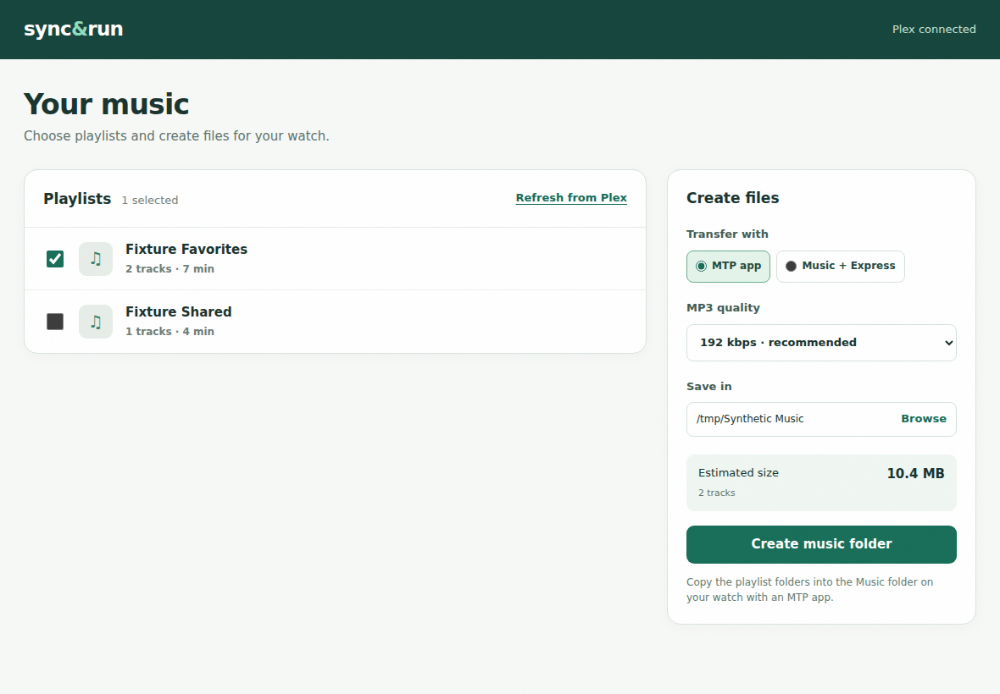

# SyncAndRun

SyncAndRun is a personal desktop app that turns Plex music playlists into local MP3 files for a Garmin music watch. Choose playlists, a transfer method, MP3 quality, and a save folder. The app creates the files and tells you what to do next.



## Move music to a watch

| Computer | Choose in SyncAndRun | Then |
| --- | --- | --- |
| macOS | MTP app | Copy the exported playlist folders into the watch's Music folder with OpenMTP or another MTP app. |
| macOS | Music + Express | Add the exported Tracks folder to Music, import `Import playlists.xml`, then send the playlists with Garmin Express. |
| Windows | Garmin Express | In Garmin Express, open the watch's Music page. Use My Music to choose the saved local folder, then send the music. |
| Windows | iTunes + Express | Add Tracks to iTunes, import the playlist XML, and send the playlists with Garmin Express. |
| Windows or Linux | MTP app | Copy the exported playlist folders into the watch's Music folder. On Linux, the Files app can open the watch as an MTP device. |

Garmin documents [local folders and music libraries in Express](https://support.garmin.com/sv-SE/?faq=1ZDlVH09XB1169yYD5FIWA), [iTunes playlist visibility](https://support.garmin.com/en-US/?faq=iBiZBj3Cer5py2x29trVN8), and [supported MP3 and M3U8 files](https://support.garmin.com/en-US/?faq=JyNEOTsZaR3KMXqej3oQp5). [Express runs on Windows and macOS, not Linux](https://support.garmin.com/en-US/navionics/faq/4QVp7mKSIA1LDk5fc1OHX8/). Apple says to [add tracks before importing a playlist XML on Mac](https://support.apple.com/es-es/guide/music/-mus27cd5060f/mac) or [in iTunes on Windows](https://support.apple.com/en-ie/guide/itunes/itns2998/windows).

SyncAndRun offers MP3 at 64, 96, 128, 192, 256, and 320 kbps. The size shown is an estimate. The app cannot read free space on the watch yet. An earlier two-folder MTP export was recognized as playlists on a personal Forerunner 955. A later Linux transfer verified 20 MP3 files at 320 kbps; the playlist appeared on the watch and a track played after a plain M3U8 was copied. See [validation](docs/VALIDATION.md).

## Linux: Rust desktop and CLI

The native Linux app uses Rust and GPUI. A CLI uses the same profile and export
engine. See [native build instructions and CLI usage](docs/RUST.md).
Create a music library folder wherever you want to stage exports, or use the
confirmed default at `~/Music/SyncAndRun`. The app writes playlist folders
directly there. After moving them to your watch, its **Clear library after
transfer** action removes unchanged app-generated files while keeping other files.

```sh
cargo build --locked --workspace
cargo run --locked -p syncandrun-desktop
cargo run --locked -p syncandrun-cli -- --help
```

Install the Linux system dependencies listed in the native guide first. Existing
Electron profiles retain their encrypted Plex connection and historical SQLite
migrations. Close Electron before opening the same profile in Rust.

The Electron implementation remains available for macOS/Windows and migration
comparison. Its source build instructions are in [development](docs/DEVELOPMENT.md).
No native Rust installer is published. See [validation](docs/VALIDATION.md) for
what has been checked separately from real-device acceptance.

The former Connect IQ app and self-hosted sync service are retired. Their source
remains in Git history. Direct MTP sync, device free-space detection, and Jellyfin
are outside this version.

SyncAndRun is GPL-3.0 software derived from [SubMusic](https://github.com/memen45/SubMusic). Its history and attribution are preserved in [LICENSE](LICENSE) and [NOTICE.md](NOTICE.md). It is unofficial and is not affiliated with Plex, Garmin, or SubMusic's maintainers. Use [GitHub Issues](https://github.com/ryancummings/syncandrun/issues) and pull requests to contribute.
