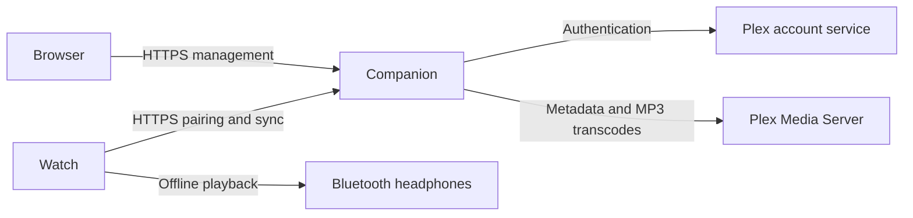

# Architecture

The Garmin watch and the companion have separate responsibilities. The companion manages Plex authentication and playlist selection. The watch synchronizes audio and plays its cached copies through Garmin's native player.

## Installation boundary

Each installation is personal to one owner and uses that owner's one Plex account, server, and music library. The owner may pair multiple watches; each watch has its own credential and synchronization state. The companion has no account sharing or service-provider mode.

An operator creates a short-lived setup link for the first owner. After that claim, only the bound Plex account can obtain management access. Disconnecting Plex must not make an installation available for a stranger to claim. A deliberate operator reset is the recovery boundary.

## Synchronization

The owner selects existing audio playlists and a Compact, Balanced, or High MP3 profile. The companion exposes bounded manifest pages under `/api/v1/watch`. The watch downloads sequentially, deduplicates shared tracks, preserves playlist order, and reuses unchanged audio. A completed HTTP transfer is not proof that Garmin committed the audio to its encrypted cache.

The watch retains its last applied revision until required downloads complete. Playback uses cached media without a phone or network. Album browsing, playlist editing, and streaming playback are outside this preview.

## Credential and data handling

The companion encrypts the Plex credential using the operator secret and stores it in SQLite. The browser and watch never receive that persisted Plex credential. Watch bearer credentials are revocable; short-lived signed artwork URLs support Garmin's image transport. Treat setup links, browser sessions, watch credentials, and artwork capabilities as sensitive.

The companion streams audio without a permanent audio cache. SQLite and the operator secret must be backed up together. HTTPS protects browser and watch traffic; the underlying watch can accept HTTP for development, but the supported deployment guides require HTTPS.

See the [protocol](protocol/README.md), [domain glossary](../CONTEXT-MAP.md), [deployment guide](DEPLOYMENT.md), and [security policy](../SECURITY.md).
