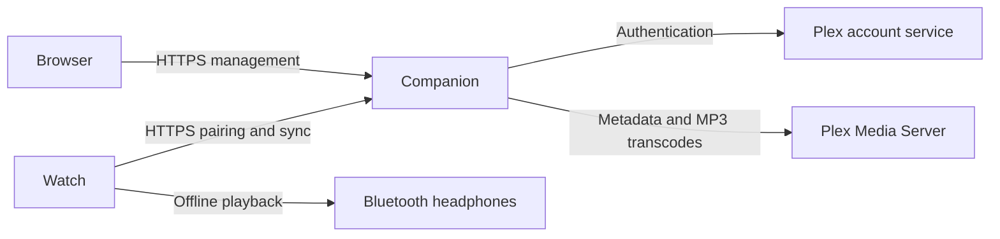

# Architecture

The Garmin watch and the companion have separate responsibilities. The companion manages Plex authentication and playlist selection. The watch synchronizes audio and plays its cached copies through Garmin's native player.

## Installation boundary

Each installation is personal to one owner and uses that owner's one Plex account, server, and music library. The owner may pair multiple watches; each watch has its own credential and synchronization state. The companion has no account sharing or service-provider mode.

An operator creates a short-lived setup link for the first owner. After that claim, only the bound Plex account can obtain management access. Disconnecting Plex must not make an installation available for a stranger to claim. A deliberate operator reset is the recovery boundary.

## Synchronization

The owner selects existing audio playlists and a Compact, Balanced, or High MP3 profile. The companion exposes bounded manifest pages under `/api/v1/watch`. The watch downloads sequentially, deduplicates shared tracks, preserves playlist order, and reuses unchanged audio. A completed HTTP transfer is not proof that Garmin committed the audio to its encrypted cache.

The watch retains its last applied revision until required downloads complete. Playback uses cached media without a phone or network. Album browsing, playlist editing, and streaming playback are outside this preview.

### Watch invariants

Preserve these boundaries when changing synchronization or storage:

- Fetch manifest pages one at a time, with at most ten items per page. Persist ordered lists in bounded chunks (currently 25 identifiers) rather than placing a whole large playlist in one storage value. The 500-track memory profiles enforce a 419,430-byte active runtime budget; this is simulator evidence, not a hardware qualification.
- Keep desired state separate from the applied library. Reuse audio only when its content fingerprint and stored Garmin media reference match. Persist each completed download before advancing so a retry can reuse it.
- Bind every audio callback to the run and track that requested it. Garmin cancellation is advisory: a late callback can arrive after another run has superseded its desired record. Delete the newly received media reference if its run is stale or its storage write is rejected; losing that reference would leave unreachable audio occupying the cache.
- Reclaim obsolete tracks only when the complete desired audio library can be committed. Removing a playlist must preserve tracks referenced by another selected playlist. Required audio failures retain the previous applied revision and completed pending downloads.
- Commit audio before optional artwork. Deduplicate artwork by identity. If artwork remains missing, refresh manifest capabilities on the next sync even when the audio revision is unchanged; matching audio must still be reused.
- Changing the companion origin invalidates pairing without deleting cached playback. Revocation blocks future synchronization but does not remove offline audio. Explicit remove-all/reset actions are destructive and require the watch's confirmation flow.

The implementation lives in [the reconciler](../watch/source/SyncAndRunReconciler.mc) and [bounded storage](../watch/source/SyncAndRunStorage.mc). [Storage regression tests](../watch/source/Tests/BoundedStorageTests.mc) cover shared tracks, interrupted downloads, and superseded records; [memory profiles](../watch/memory-profile/MemoryProfileTests.mc) cover large libraries. Keep these checks with changes to those boundaries.

## Credential and data handling

The companion encrypts the Plex credential using the operator secret and stores it in SQLite. The browser and watch never receive that persisted Plex credential. Watch bearer credentials are revocable; short-lived signed artwork URLs support Garmin's image transport. Treat setup links, browser sessions, watch credentials, and artwork capabilities as sensitive.

The companion streams audio without a permanent audio cache. SQLite and the operator secret must be backed up together. HTTPS protects browser and watch traffic; the underlying watch can accept HTTP for development, but the supported deployment guides require HTTPS.

See the [protocol](protocol/README.md), [domain glossary](../CONTEXT-MAP.md), [deployment guide](DEPLOYMENT.md), [watch troubleshooting](WATCH_TROUBLESHOOTING.md), and [security policy](../SECURITY.md).
